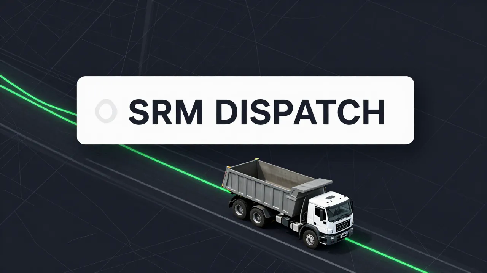

<div align="center"></div>

[](https://github.com/thebardchat/constitution)

# SRM Dispatch

> Daily route planning and driver assignment tool for SRM Concrete's North Alabama dump truck fleet. Built by a dispatcher, for a dispatcher.

This project operates under the [ShaneTheBrain Constitution](https://github.com/thebardchat/constitution/blob/main/CONSTITUTION.md).


---

```
███████╗██████╗ ███╗   ███╗
██╔════╝██╔══██╗████╗ ████║
███████╗██████╔╝██╔████╔██║
╚════██║██╔══██╗██║╚██╔╝██║
███████║██║  ██║██║ ╚═╝ ██║
╚══════╝╚═╝  ╚═╝╚═╝     ╚═╝
DISPATCH // HAZEL GREEN AL
```

---


---

## What It Does

A browser-based dispatch planning tool that generates fair, efficient daily routes for a 14-driver triaxle fleet across three North Alabama quarry locations. Built to solve real problems in a real dispatch operation — zone rotation, backhaul logic, scrap runs, Bridgeport scheduling, and driver fairness tracking.

**Core operations it handles:**
- Zone rotation across Cherokee, Mt. Hope, and Bridgeport quarries
- Fair driver assignment that tracks workload and prevents burnout
- Scrap run and POD (Proof of Delivery) scheduling
- Preload and backhaul logic
- Daily dispatch schedule generation

---

## The Fleet

14 active triaxle drivers:
`Marcus · Brittany · Eboni · Deletra · Stacey · Alexis · Kenny · Charlie · Jamie · Bryant · Jonathon · Jimmy · Eddie · Roberto`

---

## Stack

| Layer | Tech |
|-------|------|
| Framework | Vanilla JavaScript + Vite |
| UI | HTML/CSS — mobile-friendly |
| State | Client-side only (no backend) |
| Build | Vite |
| Deploy | GitHub Pages · `thebardchat.github.io/srm-dispatch` |

---

## Running Locally

```bash
git clone https://github.com/thebardchat/srm-dispatch.git
cd srm-dispatch
npm install
npm run dev
```

Runs on `localhost:5173`.

## Running on Raspberry Pi 5

```bash
ssh shane@100.67.120.6
cd /mnt/shanebrain-raid/shanebrain-core/
git clone https://github.com/thebardchat/srm-dispatch.git
cd srm-dispatch
npm install && npm run build
npx serve dist -p 3031
```

Access at `http://10.0.0.42:3031` on LAN or via Tailscale.

---

## Hardware

| Component | Spec |
|-----------|------|
| **Raspberry Pi 5** | 16GB RAM · Local dev & hosting node |
| **Pironman 5-MAX** | NVMe RAID 1 chassis by Sunfounder |
| **2× WD Blue SN5000 2TB NVMe** | RAID 1 via mdadm |

---

## Constitutional Alignment

This tool is built for the real world — a dispatcher who is also the sole provider for his family. Every design decision follows the [ShaneTheBrain Constitution](https://github.com/thebardchat/constitution/blob/main/CONSTITUTION.md):

- **ADHD-aware design** — one screen, clear actions, no friction
- **Local-first** — runs fully offline on Pi, no cloud required
- **Serves the left-behind** — built for operators, not SaaS buyers

---

## Built With

| Partner | Role |
|---------|------|
| **Claude by Anthropic** · [claude.ai](https://claude.ai) | Co-built every line of this project |
| **Raspberry Pi 5** · [raspberrypi.com](https://www.raspberrypi.com) | Local compute backbone |
| **Pironman 5-MAX** · [pironman.com](https://www.pironman.com) | NVMe RAID 1 chassis |

> *Part of the [ShaneBrain Ecosystem](https://github.com/thebardchat) · Hazel Green, Alabama*

---

## License

MIT — free to use, fork, and adapt for your own dispatch operation.


---

## Support This Work

If what I'm building matters to you — local AI for real people, tools for the left-behind — here's how to help:

- **[Sponsor me on GitHub](https://github.com/sponsors/thebardchat)**
- **[Buy the book](https://www.amazon.com/Probably-Think-This-Book-About/dp/B0GT25R5FD)** — *You Probably Think This Book Is About You*
- **Star the repos** — visibility matters for projects like this

Built by **Shane Brazelton** · Co-built with **Claude** (Anthropic) · Hazel Green, Alabama

---

<div align="center">

*Part of the [ShaneBrain Ecosystem](https://github.com/thebardchat) · Built under the [Constitution](https://github.com/thebardchat/constitution)*

</div>
